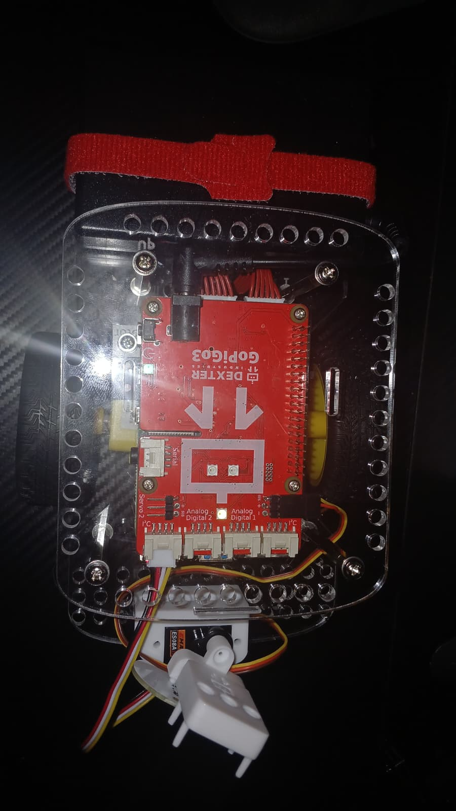
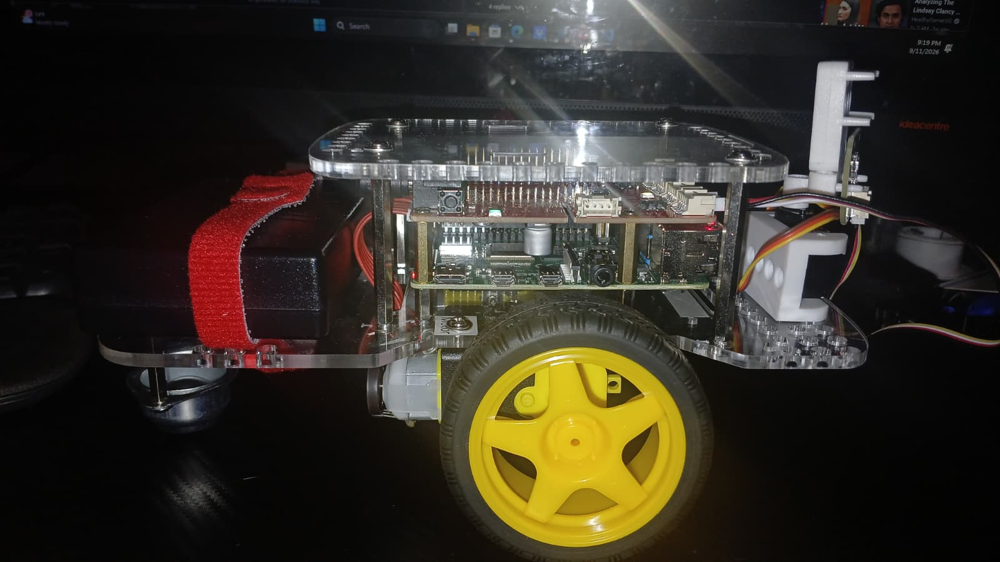

# CSC 4120 Introduction to Robotics

## Module 1

### Exercise 1 - Build the GoPiGo Robot
- Assembled chassis and motors
- Mounted GoPiGo board

### Exercise 2 - Jupyter Environment
- Installed GoPiGo OS
- Connected to GoPiGo robot, connected it to network
- Practiced Jupyter notebook basics

### Exercise 3 - First Ride Around
- Ran First_Ride_Around.ipynb
- Tested forward, left, stop, right, backward buttons
- 

### Exersice 4 - Hardware Testing
- Checked battery voltage, board info, and firmware
- Ran motor and encoder tests
- 